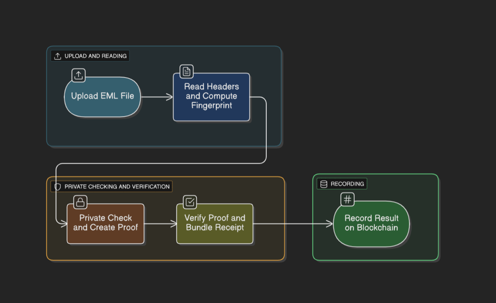

# NULLID – ZK Email Attestation (zkVerify + Horizen)

Prove “this .eml asserts affiliation with an org domain” without revealing the email itself. We generate a Groth16 proof, register a vkey (vkHash), submit via zkVerify’s relayer to get an Aggregated receipt, pre‑check on-chain against zkVerify’s proxy, and record a statement in your registry contract on Horizen testnet.



---

## What it does (user perspective)
Open communities (Telegram/Discord/X/email lists) are flooded with spoofed org accounts and bots. With this, you upload a real `.eml`, we create a zero‑knowledge proof that the message asserts your org affiliation, a zkVerify receipt is published, and communities/partners check a single on‑chain statement instead of trusting screenshots or DMs.

## What it provides (dev perspective)
A production‑style zkVerify integration:
- Circom/Groth16 circuit (public signal: `eml_commitment`)
- Prover flow (snarkjs) → `proof.json`, `public.json`
- vkey registration → `vkHash`
- Relayer submit → Aggregated receipt (leaf/merklePath/leafCount/index)
- On‑chain precheck (zkVerify proxy), then `recordWithLeaf(...)` on your registry contract

---

## Repository layout
- `circuits/eml_receiver.circom` — checks `From:`, `To:`, `@gmail.com` and Poseidon commitment (public `eml_commitment`)
- `tools/build_input.js` — pads .eml to 8 KiB, finds indices, builds selectors, computes commitment
- `relayer/submit.js` — submits, waits for Aggregated (+15s grace), zkVerify view precheck, records on-chain
- `contracts/EmlProofRecorder.sol` — binds `_zkVerify` (proxy) and `_vkey` (vkHash); `recordWithLeaf(...)`
- `arch.md` — ASCII diagram
- `image.png` — architecture image (used above)
- `.env.example` — env template (no secrets)

---

## Quick start (users)
1) Prepare a `.eml` (raw RFC‑822). It must contain `From:`, `To:`, and the target domain token (demo uses `@gmail.com`).
2) Upload in the app flow; you’ll either get a verified receipt or be declined (no private email content is revealed).
3) Use the receipt to join a community, claim a role, or attach to outreach.

---

## Quick start (devs)

Prereqs: Node 18+, Git, npx snarkjs, wallet funded on Horizen testnet (Base Sepolia).

### 0) Clone & install
```bash
git clone https://github.com/cadalt0/NULLID-ZKVERIFY.git
cd NULLID-ZKVERIFY
npm i axios ethers circomlibjs
```

### 1) Environment
Copy `.env.example` → `.env` and fill:
```bash
API_KEY=your_relayer_api_key
PRIVATE_KEY=0xYOUR_PRIVATE_KEY
RPC_URL=https://horizen-rpc-testnet.appchain.base.org
ZKVERIFY_ADDR=0x201B6ba8EA862d83AAA03CFbaC962890c7a4d195
REGISTRY_ADDR=0xYourDeployedRecorderContract
```

### 2) Compile circuit
```bash
circom circuits/eml_receiver.circom --r1cs --wasm --sym -o build -l circomlib/circuits
```

### 3) Proving key & vkey
Use large ptau (2^20 recommended):
```bash
npx snarkjs groth16 setup build/eml_receiver.r1cs powersOfTau28_hez_final_20.ptau build/eml_receiver.zkey
npx snarkjs zkey export verificationkey build/eml_receiver.zkey build/vkey.json
```

### 4) Register vkey → vkHash (once per zkey)
```bash
node -e "const fs=require('fs');const axios=require('axios');(async()=>{const API_URL='https://relayer-api.horizenlabs.io/api/v1';const API_KEY=process.env.API_KEY;const vkey=JSON.parse(fs.readFileSync('build/vkey.json'));const reg={proofType:'groth16',proofOptions:{library:'snarkjs',curve:'bn128'},vk:vkey};const res=await axios.post(API_URL+'/register-vk/'+API_KEY,reg);console.log(res.data);fs.mkdirSync('relayer',{recursive:true});fs.writeFileSync('relayer/circom-vkey.json',JSON.stringify(res.data));})().catch(e=>{console.error(e.response?.data||e.message);process.exit(1);})"
```
Note the `vkHash` and deploy your recorder with it.

### 5) Build inputs from .eml
```bash
node tools/build_input.js ./test.eml
```
Creates `input.json` with: `eml_commitment`, byte array, and selectors.

### 6) Prove
```bash
npx snarkjs wtns calculate build/eml_receiver_js/eml_receiver.wasm input.json witness.wtns
npx snarkjs groth16 prove build/eml_receiver.zkey witness.wtns proof.json public.json
npx snarkjs groth16 verify build/vkey.json public.json proof.json
```
`public.json` must contain exactly one number: the `eml_commitment` field element.

### 7) Submit & auto‑record
```bash
node relayer/submit.js
```
The script:
- submits with `vkRegistered=true` and your `vkHash`
- polls until `Aggregated`, waits +15s
- calls zkVerify `verifyProofAggregation` (view); if false, tries reversed Merkle path
- if true, calls `recordWithLeaf(...)` on your recorder

---

## Addresses (Horizen testnet)
- zkVerify Aggregation Proxy: `0x201B6ba8EA862d83AAA03CFbaC962890c7a4d195`
- System Domain: `113`
- Your Recorder Contract: set `REGISTRY_ADDR` in `.env`

References:  
- Smart Contract Verification: https://docs.zkverify.io/overview/getting-started/smart-contract  
- Register vkey: https://docs.zkverify.io/overview/getting-started/register-vk  
- Contract addresses: https://docs.zkverify.io/overview/contract-addresses  
- Domain management: https://docs.zkverify.io/architecture/proof-aggregation/domain-management

---

## Troubleshooting
- `public.json` is empty  
  Re-used old zkey compiled before public signal. Re-run setup (new zkey), export vkey, re-register to get new vkHash.
- zkVerify view is false  
  Use domain `113` (or relayer-provided domain). Try reversed `merklePath` once.
- Tx reverts  
  Contract `_vkey` must equal your current `vkHash`. Use the Horizen proxy above. Ensure `public.json` has exactly 1 value.

---

## Security & privacy
- No inbox content revealed—circuit proves structure & headers against a commitment.
- Secrets loaded from `.env` (not committed). `.gitignore` excludes heavy artifacts and secrets.

## License
MIT
